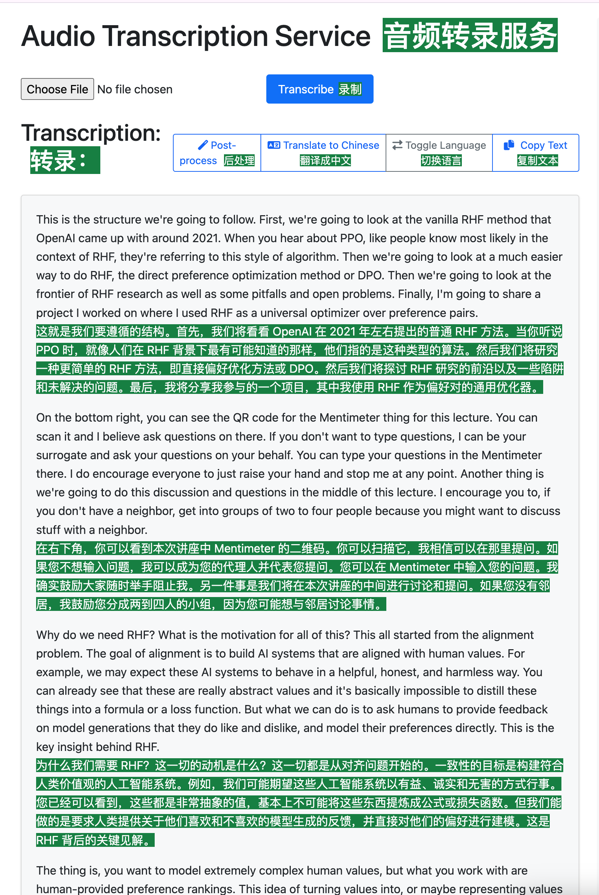

# Audio/Video Transcription Service

A web application that transcribes audio and video files using OpenAI's Whisper API, with GPT-4o post-processing for improved formatting.

## Preview
Combined with chinese translation chrome extension:

## Features

- Audio and video file transcription
- Support for large files (auto-splitting)
- Markdown formatted output
- Real-time processing status
- Transcription history
- Copy to clipboard functionality
- Dark mode support
- Background task processing

## Supported File Formats

- Audio: MP3, WAV, M4A, MPGA
- Video: MP4, WEBM

## Prerequisites

### System Requirements

- Python 3.8 or higher
- Redis server
- ffmpeg (for audio processing)

### Installing System Dependencies

#### Ubuntu/Debian
bash
#### Install Redis
sudo apt-get update
sudo apt-get install redis-server

#### Install ffmpeg
sudo apt-get install ffmpeg

#### configure openai api key
create a file named .env in the root directory and add the following line:
OPENAI_API_KEY=your_api_key

### 1. Start Redis server (if not already running):
sudo service redis-server start # On Ubuntu/Debian

### 2. Start Celery worker (in a separate terminal):
celery -A celery_worker.celery worker --loglevel=info --concurrency=4

### 3. Run the Flask application:
python app.py

